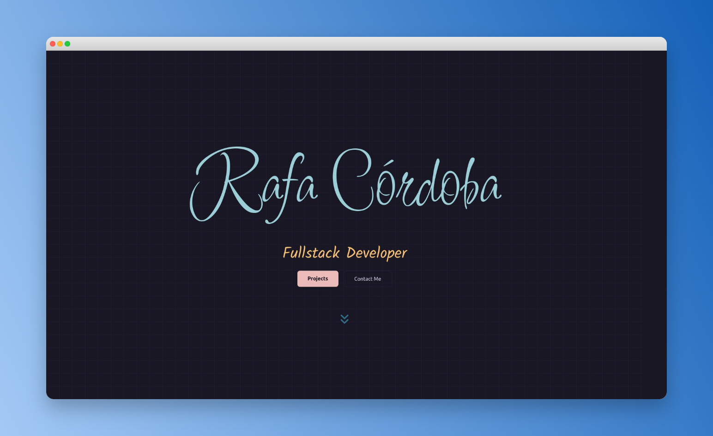

# 🚀 Mori Portfolio | Built with Astro & Tailwind CSS

A minimalist, high-performance personal portfolio designed to showcase my projects and skills. Built with a focus on speed, clean code, and modern aesthetics.


**Live Demo:** [mori-delta.vercel.app](https://mori-delta.vercel.app)


---

## 🛠️ Tech Stack

* **Framework:** [Astro](https://astro.build/)
* **Styling:** [Tailwind CSS](https://tailwindcss.com/)
* **Icons:** [Lucide Icons](https://lucide.dev/) / [Astro Icon](https://www.astroicon.dev/)
* **Deployment:** [Vercel](https://vercel.com/)

---

## 📁 Project Structure

```text
/
├── public/          # Static assets (images, icons, etc.)
├── src/
│   ├── components/  # Reusable UI elements (Navbar, ProjectCards)
│   ├── layouts/     # Page templates
│   ├── pages/       # Routes and main views
│   ├── assets/      # Various assets for the frontend.
│   └── styles/      # Global CSS and Tailwind configurations
├── astro.config.mjs 
└── tailwind.config.mjs
```
---

# 🧑‍💻Run this project locally

- Download the project or clone it:
```Shell
git clone https://github.com/MoriitoDev/Astro-Portfolio.git
```

- Install dependencies:
```Shell
npm install
```

- Start the development server:
```Shell
npm run dev
```